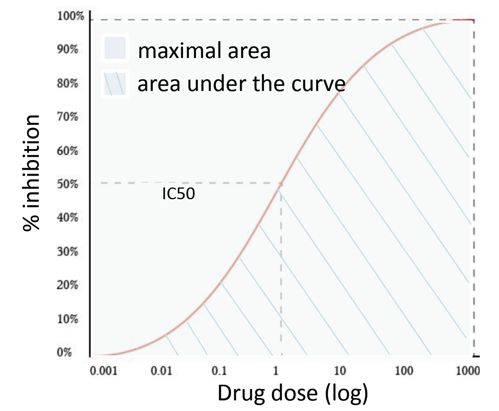
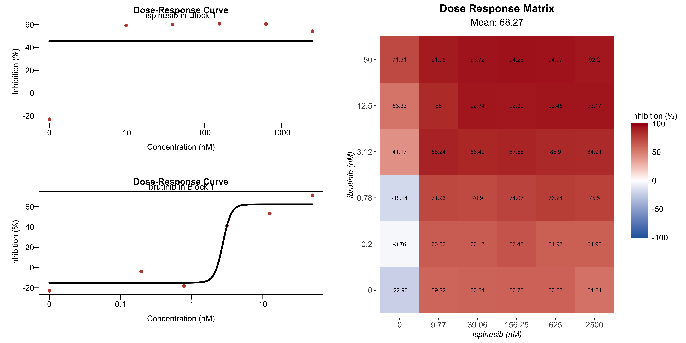
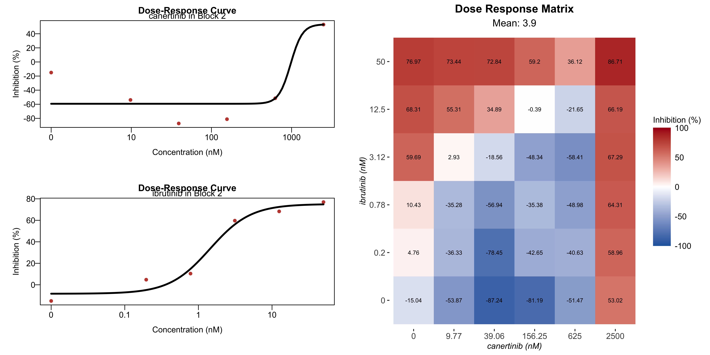
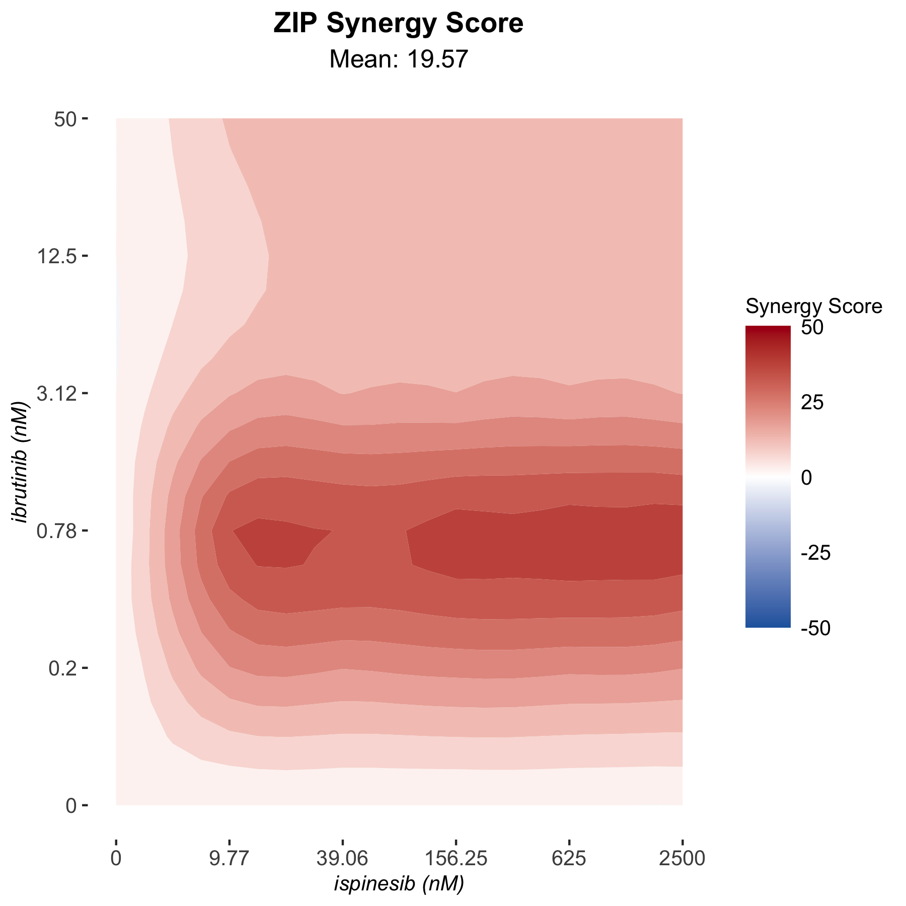
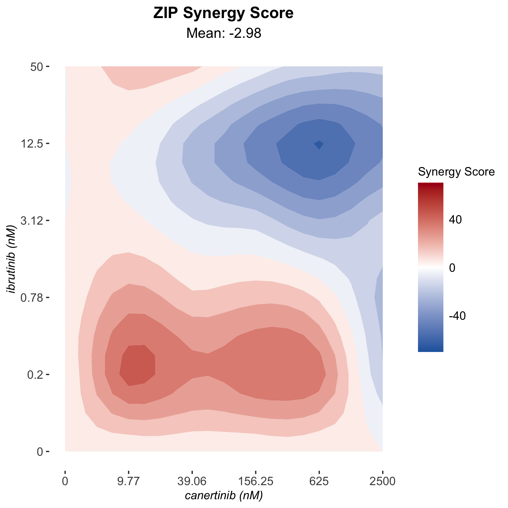
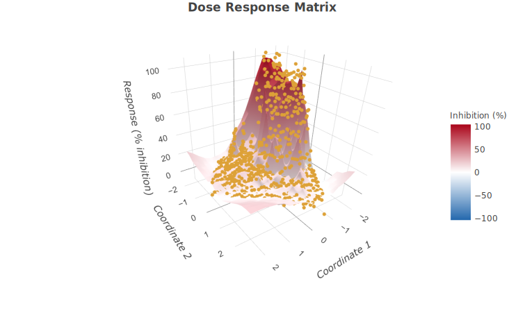
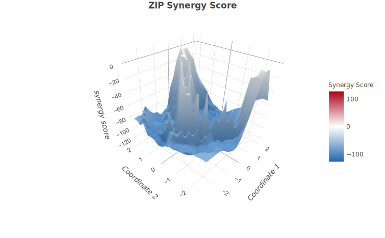

```{r, include = FALSE}
knitr::opts_chunk$set(
  collapse = TRUE,
  comment = "#>"
)
```

# Summary

Combinatorial therapies is one of the major strategies for improving treatment efficacy in treating cancer. High-throughput drug combination screening has the advantage of assaying a large collection of chemical compounds in search for promising drug pairs. Studies that utilizes drug combination screening have generated dynamic dose-response profiles that allow researchers to quantify the degree of drug-drug interactions at an unprecedented level. *SynergyFinder* R package is a software tool to analyze such pre-clinical drug combination data sets. It provides efficient implementations for 

1.the popular synergy scoring models, including HSA, Loewe, Bliss, and ZIP to quantify the degree of drug combination synergy;
2. higher order drug combination data analysis and synergy landscape visualization for unlimited number of drugs in a combination;
3. statistical analysis of drug combination synergy and sensitivity with confidence intervals and p-values;
4. synergy barometer for harmonizing multiple synergy scoring methods to provide a consensus metric of synergy;
5. evaluation of synergy and sensitivity simultaneously to provide an unbiased interpretation of the clinical potential of the drug combinations.

To facilitate the use of the R package for the drug discovery community, we also provide a web server at https://synergyfinderplus.org/ as a user-friendly interface to enable a more flexible and versatile analysis of drug combination data. In the web application, in addition to the functions in R package, we provide the annotation of drugs and cell lines that are tested in an experiment, including their chemical information, targets and signaling network information.

# 1 Installation

**Note:** We recommend to install *Bioconductor >= 3.13* and *SynergyFinder >= 3.0.1* to access the new features described in this vignette. 

To install the *SynergyFinder* package from [Bioconductor](https://www.bioconductor.org/packages/release/bioc/html/synergyfinder.html), start R (>= 4.0) and then enter:

```{r eval=FALSE}
if (!requireNamespace("BiocManager", quietly = TRUE))
    install.packages("BiocManager")

BiocManager::install("synergyfinder")
```

Load *SynergyFinder* to R environment

```{r message=FALSE}
library(synergyfinder)
```

# 2 Input data

*synergyfinder* requires a data frame that describes the drug combination data set. The dose-response data is represented as a long table where each row represent one observation in the dose-response matrix.

The input table must contain the following columns (The column naming styles used by the old versions of *synergyfinder* or [DrugComb](https://drugcomb.org/), i.e. 'Alternative Column names' are accepted):

| Required Columns | Alternative Column names         | Description                                                     |
| ---------------- | -------------------------------- | --------------------------------------------------------------- |
| block\_id        | PairIndex, BlockId               | Identifier for the drug combination blocks.                     |
| drug1            | Drug1, drug\_row, DrugRow        | Name of the first tested drug.                                  |
| drug2            | Drug2, drug\_col, DrugCol        | Name of the second tested drug.                                 |
| conc1            | Conc1, conc\_row, ConcRow        | Concentration of first tested drug.                             |
| conc2            | Conc2, conc\_col, ConcCol        | Concentration of second tested drug.                            |
| response         | Response, inhibition, Inhibition | Cell response to the drug treatment (%inhibition or %viability).|
| conc\_unit       | ConcUnit                         | Unit of concentration for drugs. This column could be replaced by multiple separated columns for each tested drugs (see table below), while different unit was used for measuring the concentrations.|

There are several optional columns available for the higher-order drug combination data sets or the data sets using different concentration units for drugs.

| Optional Columns | Alternative Column names         | Description                                                                              |
| ---------------- | -------------------------------- | ---------------------------------------------------------------------------------------- |
| conc\_unit1      | conc\_r\_unit                    | Unit of concentration for the first drug. Used if the concentration units are not identical across the drugs tested in one block.|
| conc\_unit2      | conc\_c\_unit                    | Unit of concentration for the second drug. Used if the concentration units are not identical across the drugs in test one block.|
| drug[n]          |                                  | Name of the n_th_ tested drug. For example, "drug3" for the third tested drug. Used for higher-order drug combination data point.|
| conc[n]          |                                  | Concentration of n_th_ tested drug. Used for higher-order drug combination data point.|
| conc\_unit[n]    |                                  | Unit of concentration for n_th drug. Used if the concentration units are not identical across the drugs in test one block.|

**Note:** 

1. The duplicated concentration combinations in one block (with the same "block_id") will be treated as replicates.
2. There is no restriction on the number of drug combinations (blocks) for the input file. The data should however, contain **at least three concentrations for each drug** in each block, so that sensible synergy scores can be calculated.
3. *synergyfinder* allows for missing values in the dose-response matrix. The missing value will be automatically imputed by [mice](https://amices.org/mice/) R package.

*SynergyFinder* provides an example input data (`mathews_screening_data`) in the package, which is extracted from a published drug combination screening study for the treatment of diffuse large B-cell lymphoma (DLBCL) [1]. The example input data contains two representative drug combinations (ibrutinib & ispinesib and ibrutinib & canertinib) for which the %viability of a cell line TMD8 was assayed using a 6 by 6 dose matrix design. To load the example data, please run:

```{r}
data("mathews_screening_data")
head(mathews_screening_data)
```

# 3 Reshaping and pre-processing

We provide a function `ReshapeData` to reshape and pre-process the input data for further analysis:

Important parameters:

* `data_type`: User must specify the type for the observations in column "response" in the input data. Its value must be either "viability" meaning the %viability of cell or "inhibition" indicating %inhibition of the cell growth;
* `impute`: Impute missing values in response data by calling function `mice::mice`. If input matrix contains missing values, the function will automatically perform the imputation with the selected imputation method. The parameter `impute_method` is used to define the method in imputation. The default method (when `impute_method = NULL`) is predictive mean matching (pmm). Please check the [doc](chrome-extension://oemmndcbldboiebfnladdacbdfmadadm/https://cran.r-project.org/web/packages/mice/mice.pdf) for `mice` function in `mice` R package for more available methods;
* `noise`: Add small random number to response data to avoid the error caused by exact same response values. We recommend to set it as TRUE. The parameter `seed` is used to set the random seed to make the result reproducible.

```{r}
res <- ReshapeData(
  data = mathews_screening_data,
  data_type = "viability",
  impute = TRUE,
  impute_method = NULL,
  noise = TRUE,
  seed = 1)
```

The output `data` is a list containing following components:

* *drug_pairs*: A data frame contains the name of all the tested drugs, concentration unit, block IDs and a logical column "replicate" to indicate whether there are replicates in the corresponding block.
* *response* A data frame contains the columns: 
  * "block_id" - the identifier for blocks;
  * "concX" - concentrations for drugs from input data; 
  * "response_origin" - response values from input data;
  * "response" - %inhibition value for downstream analysis. It has been added the random noise and imputed missing values.

```{r}
str(res)
```

# 4 Synergy and sensitivity analysis

## 4.0 Baseline Correction

Typically, the models for estimating synergy or sensitivity of drug combinations expect that the drug's effect to be expressed as continuous values ranged between 0 and 1 (or between 0% and 100%). However, in practice the readouts from the drug combination screening could be negative. In this cases, the technical error might be introduced in the dose-response data. The base line correction function is designed to adjust the “baseline” of the dose-response data closer to 0. Following is the main steps for the process of “baseline correction”:

1. Extract all the single drug treatment (monotherapy) dose-response data from the combination.
2. Fit the four-parameter log logistic model for each monotherapy with the data table from step 1.
3. Pick the minimum fitted response value from all the models fitted in step 2 as “baseline”.
4. Adjusted response value = observed response value - ((100 – observed response value) / 100 * baseline).

By setting the value of the parameter `correct_baseline` while calling function `CalculateSynergy` or `CalculateSensitivity`, user could chose:

  * "non" - do not correct base line;
  * "part" - correct base line but only adjust negative response values in matrix;
  * "all" - correct base line with adjusting all values in matrix.
  
## 4.1 Drug synergy scoring

The synergistic effect can be determined as the excess of observed effect over expected effect calculated by a reference models (synergy scoring models). All of the models make different assumptions regarding the expected effect. Currently, 4 reference models are available in *SynergyFinder*. 

* **Highest Single Agent (HSA)** [2] states that the expected combination effect equals to the higher effect of individual drugs:

$$y_{HSA} = max(y_1, y_2)$$
where $y_1$ and $y_2$ are the monotherapy effect of combined drug 1 and drug 2

* **Bliss** model [3] assumes a stochastic process in which two drugs exert their effects independently, and the expected combination effect can be calculated based on the probability of independent events as:

$$
		y_{Bliss} = y_1 + y_2 - y_1 \cdot y_2
$$
where $y_1$ and $y_2$ are the monotherapy effect of combined drug 1 and drug 2

* **Loewe** additivity model [4] defines the expected effect $y_{Loewe}$ as if a drug was combined with itself, i.e. $y_{Loewe} = y_1(x_1 + x_2) = y_2(x_1 + x_2)$. Unlike the HSA and the Bliss independence models, which give a point estimate using different assumptions, the Loewe additivity model considers the dose-response curves of individual drugs. The expected effect $y_{Loewe}$ must satisfy:

$$
		\frac
		{x_1}{\chi_{Loewe}^1}
		+
		\frac{x_2}{\chi_{Loewe}^2} 
		= 1
$$

where $x_{1,2}$ are drug doses and $\chi_{Loewe}^1,\ \chi_{Loewe}^2$ are the doses of drug 1 and 2 alone that produce $y_{Loewe}$.
Using 4-parameter log-logistic (4PL) curves to describe dose-response curves the following parametric form of previous equation is derived:

$$
		\frac
		{x_1}{m_1(\frac{y_{Loewe}-E_{min}^1}{E_{max}^1 - y_{Loewe}})^{\frac{1}{\lambda_1}}}
		+
		\frac{x_2}{m_2(\frac{y_{Loewe}-E_{min}^2}{E_{max}^2 - y_{Loewe}})^{\frac{1}{\lambda_2}}}
		= 1
$$
where $E_{min}, E_{max}\in[0,1]$ are minimal and maximal effects of the drug, $m_{1,2}$ are the doses of drugs that produce the midpoint effect of $E_{min} + E_{max}$, also known as relative $EC_{50}$ or $IC_{50}$, and $\lambda_{1,2}(\lambda>0)$ are the shape parameters indicating the sigmoidicity or slope of dose-response curves. A numerical nonlinear solver can be then used to determine $y_{Loewe}$ for ($x_1$, $x_2$).

* **Zero Interaction Potency (ZIP)** [5] calculates the expected effect of two drugs under the assumption that they do not potentiate each other, i.e. both the assumptions of the Loewe model and the Bliss model are met:

$$
y_{ZIP} = \frac{(\frac{x_1}{m_1}) ^ {\lambda_1}}{(1 + \frac{x_1}{m_1})^{\lambda_1}}+\frac{(\frac{x_2}{m_2})^{\lambda_2}}{(1 + \frac{x_2}{m_2})^{\lambda_2}} - \frac{(\frac{x_1}{m_1})^{\lambda_1}}{(1 + \frac{x_1}{m_1})^{\lambda_1}} \cdot \frac{(\frac{x_2}{m_2})^{\lambda_2}}{(1 + \frac{x_2}{m_2})^{\lambda_2}}
$$
where $x_{1, 2}, m_{1, 2}, and\ \lambda_{1, 2}$ are defined in the Loewe model.

For the input data without replicates, the statistical analysis for synergy scores of the whole dose-response matrix is estimated under the null hypothesis of non-interaction (zero synergy score). Suppose that $S_1, S_2, ...S_n$ are the synergy scores for all the concentration combinations (excluding monotherapies) for the dose-response matrix with mean of $\bar s$. The p-value is:

$$p = exp(-0.717z - 0.416z^2),\ where\ z = abs(\bar s')/\sqrt{\frac{1}{n - 1}\sum_{i = 1}^n(s_i' - \bar s')^2}$$

The function `CalculateSynergy` is designed to calculate the synergy scores. Important parameters are:

* `data`: The R object generated by function `ReshapeData`;
* `method`: The reference model for synergy score calculation. Parameter `Emin` and `Emax` are used to set the corresponding parameters in the 4 parameter log-logistic model which will be fitted to calculate "ZIP" and "Loewe" synergy scores;
* `correct_baseline`: Whether to adjust base line of response matrix. 

```{r message=FALSE, warning=FALSE}
res <- CalculateSynergy(
  data = res,
  method = c("ZIP", "HSA", "Bliss", "Loewe"),
  Emin = NA,
  Emax = NA,
  correct_baseline = "non")
```

The output adds one data frame "synergy_scores" to the input R object. It contains:

* "block_id" - The identifier for drug combination blocks;
* "concX" - The concentration for combined drugs;
* "ZIP_ref", "HSA_ref", "Bliss_ref", and "Loewe_ref" - The reference additive effects calculated from corresponding models;
* "ZIP_synergy", "HSA_synergy", "Bliss_synergy" and "Loewe_synergy - The synergy scores calculated from corresponding models;
* "ZIP_fit" - The fitted %inhibition for combinations which is used to calculate the ZIP synergy score.

The mean of synergy scores for the combination matrix (excluding the monotherapy observations) and the p-values for them are added to the "drug_pairs" table in the input R object.

```{r}
res$drug_pairs
str(res$synergy_scores)
```

## 4.2 Sensitivity scoring

*SynergyFinder* mainly calculates 3 sensitive scores: relative IC50 and relative inhibition (RI) for single drug treatment, and combination sensitivity score (CSS) for drug combinations.

* **Relative IC50**: *SynergyFinder* extracts the single drug treatment response data from the combination matrix to fit the 4-parameter log-logistic curve:

$$y = y_{min} + \frac{y_{max} - y_{min}}{1 + 10^{\lambda(log_{10}IC_{50} - x')}}$$
where $y_{min}, y_{max}$ are minimal and maximal inhibition and $x' = log_{10}x$

* **RI**: RI is the abbreviation of “relative inhibition”. It is the proportion of the area under the dose-response curve (fitted by four parameter log logistic model), to the maximal area that one drug can achieve at the same dose range (Figure 1). For example, RI of 40 suggests that the drug is able to achieve 40% of the maximal of inhibition (e.g. a positive control where the cell is 100% inhibited in each dose that in the range). RI is comparable between 
different scenarios, even for the same drug-cell pair but tested in different concentration ranges.

```{r fig.cap="Figure 1. Concept of RI", fig.show="hold", out.width="60%"}

```

* **CSS**: CSS is the abbreviation of "Combination Sensitivity Score". It is derived using relative IC50 values of compounds and the area under their dose-response curves. CSS of a drug combination is calculated such that each of the compounds (background drug) is used at a fixed concentration (its relative IC50) and another is at varying concentrations (foreground drug) resulting in two CSS values, which are then averaged. Each drug's dose-response is modeled using 4-parameter log-logistic curve. The area under the log-scaled dose-response curve (AUC) is then determined according to:

$$AUC = \int_{c_1}^{c_2}y_{min} + \frac{y_{max}-y_{min}}{1 + 10^{\lambda(log_{10}IC_{50}-x')}}dx'$$
where $[c_1, c_2]$ is the concentration range of the foreground drug tested.[6]

The function `CalculateSensitivity` is designed to calculate the synergy scores. Important parameters are:

* `data`: The R object generated by function `ReshapeData`;
* `correct_baseline`: Whether to adjust base line of response matrix

```{r message=FALSE, warning=FALSE}
res <- CalculateSensitivity(
  data = res,
  correct_baseline = "non"
)
```

Following sensitivity scores are added to the "drug_pairs" table in the input R object:

* "ic50_x": The relative IC50 for drug x;
* "ri_x": The RI for drug x;
* "cssx_ic50y": The css for drug x while drug y is at its relative IC50;
* "css": The CSS for the combination.

```{r}
sensitive_columns <- c(
  "block_id", "drug1", "drug2",
  "ic50_1", "ic50_2",
  "ri_1", "ri_2",
  "css1_ic502", "css2_ic501", "css")
res$drug_pairs[, sensitive_columns]
```

# 5 Visualization

## 5.1 Dose-response curve

The `PlotDoseResponseCurve` function will plot the dose-response curve fitted by 4-parameter log logistic function for selected drug. Important parameters are:

* `data`: The R object generated by function `ReshapeData`;
* `plot_block`: Select the block from which to extract the monotherapy dose-response data;
* `drug_indes`: Select the drug from the combination to draw the dose-response curve. Available values are 1, 2, 3, ... to indicates the drug 1, drug 2, drug 3, ... in the combination.

This function will return an object of class `recordedplot`. User could use `replayPlot` to plot it. User could modify the parameter `plot_setting` to control the themes of some items in the plot.

```{r message=FALSE, warning=FALSE, fig.width=7, fig.height=4, out.width="100%"}
for (i in c(1, 2)){
  PlotDoseResponseCurve(
    data = res,
    plot_block = 1,
    drug_index = i,
    plot_new = FALSE,
    record_plot = FALSE
  )
}
```

If parameter `record_plot` is set as `TRUE`, the function will return a plot object recorded by `recordPlot`.

## 5.2 Two-drug combination visualization

*SynergyFinder* provides 3 types (Heatmap, 2D contour plot, or 3D surface) of plots to visualize dose-response map or synergy map for two-drug combinations. 

From the plots for dose-response landscape, user can assess the therapeutic significance of the combination, e.g. by identifying the concentrations at which the drug combination can lead to a maximal effect on cancer inhibition. 

The landscape of drug interaction scoring is very informative when identifying the specific
dose regions where a synergistic or antagonistic drug interaction occurs.

Important parameters shared by all the three functions are:

* `data`: The R object generated by function `ReshapeData` or `CalculateSynergy`;
* `plot_block`: Select the block from which to extract the two-drug combination matrix;
* `drugs`: Select two drugs for plot from the combination. Available values are 1, 2, 3, ... to indicates the drug 1, drug 2, drug 3, ... in the combination;
* `plot_value`: Select the value for plots. The available values are: 
  * "response_origin" The original response value in input data. It might be % inhibition or %viability;
  * "response" The % inhibition after pre-process by function `ReshapeData`;
  
  If the data is the output from `CalculateSynergy`, following values are also available:
  
  * "ZIP_ref", "Bliss_ref", "HSA_ref", or "Loewe_ref" The reference additive effects calculated by ZIP, Bliss, HSA or Loewe model, respectively;
  * "ZIP_synergy", "Bliss_synergy", "HSA_synergy", "Loewe_synergy" The synergy score calculated by ZIP, Bliss, HSA or Loewe model, respectively;
  * "ZIP_fit" The response fitted by ZIP model.
* `dynamic`: Whether to plot a dynamic plot or static plot. Dynamic plots are generated with `plotyly`. It could be used on interactive platforms, such as R Shiny or Rmarkdown.
* `summary_statistic`: Select the summary statistics for all the `plot_value` in whole combination matrix. It will be shown as the subtitle in the plots. If it is NULL, no statistics will be printed. User can specify one or more values listed below:
  * "mean" Mean value for all the responses or synergy scores in the matrix and the p-value if it is valid;
  * "median" Median value for all the responses or synergy scores in the matrix;
  * "quantile_90" 90% quantile. User could change the number to print different sample quantile. For example "quantile_50" equal to median.

Following shows the examples for dose-response and ZIP synergy landscape.

### 5.2.1 Heatmap

If `dynamic` is set as `FALSE`, this function will return a `ggplot` object. User could use `+ theme()` to adjust the plot theme. 

```{r fig.show="hold", fig.width=7, fig.height=4, out.width="100%"}
Plot2DrugHeatmap(
    data = res,
    plot_block = 1,
    drugs = c(1, 2),
    plot_value = "response",
    dynamic = FALSE,
    summary_statistic = c("mean",  "median")
  )

Plot2DrugHeatmap(
    data = res,
    plot_block = 1,
    drugs = c(1, 2),
    plot_value = "ZIP_synergy",
    dynamic = FALSE,
    summary_statistic = c( "quantile_25", "quantile_75")
  )
```

### 5.2.2 2D contour plot

If `dynamic` is set as `FALSE`, this function will return a `ggplot` object. User could use `+ theme()` to adjust the plot theme. 

```{r fig.show="hold", fig.width=7, fig.height=4, out.width="100%"}
Plot2DrugContour(
    data = res,
    plot_block = 1,
    drugs = c(1, 2),
    plot_value = "response",
    dynamic = FALSE,
    summary_statistic = c("mean", "median")
  )
Plot2DrugContour(
    data = res,
    plot_block = 1,
    drugs = c(1, 2),
    plot_value = "ZIP_synergy",
    dynamic = FALSE,
    summary_statistic = c("quantile_25", "quantile_75")
  )
```

### 5.2.3 3D surface plot

If parameter `dynamic` is set as `FALSE`, this function will return an object of class `recordedplot`. User could use `replayPlot` to plot it.

```{r fig.width=9, fig.height=6, eval=FALSE}
Plot2DrugSurface(
  data = res,
  plot_block = 1,
  drugs = c(1, 2),
  plot_value = "response",
  dynamic = FALSE,
  summary_statistic = c("mean", "quantile_25", "median", "quantile_75")
)
Plot2DrugSurface(
  data = res,
  plot_block = 1,
  drugs = c(1, 2),
  plot_value = "ZIP_synergy",
  dynamic = FALSE,
  summary_statistic = c("mean", "quantile_25", "median", "quantile_75")
)
```

```{r fig.width=6, fig.height=4, fig.show="hold", out.width="100%", echo=FALSE}
for (v in c("response", "ZIP_synergy")) {
  Plot2DrugSurface(
    data = res,
    plot_block = 1,
    drugs = c(1, 2),
    plot_value = v,
    dynamic = FALSE,
    summary_statistic = c("mean", "quantile_25", "median", "quantile_75")
  )
}
```

It is recommend to plot the 3D surface in dynamic (`dynamic=TRUE`) way, with which user could adjust the view point in an interactive way to show the surface at the best angle.

## 5.3 Plotting wrapper for two-drug combination

*SynergyFinder* provides two plotting wrapper for two-drug combination dose-response visualization (`PlotDoseResponse`) and synergy score visualization (`PlotSynergy`).

The function `PlotDoseResponse` combined the dose-response curve and dose-response heatmap in one figure. In addition to the parameters inherited from `PlotDoseResponseCurve` and `Plot2DrugHeatmap`, this function has the parameters for saving the plot as a file, including:

* `save_file` Whether to save the plot into a file;
* `file_type` The file format. Default is "pdf". Available values are "jpeg", "bmp", "png", "tiff", "pdf", "svg";
* `file_name` The name of the file. If it is `NULL` the default file names containing drug names and block ID are used.

```{r fig.width=6, fig.height=4, eval=FALSE}
PlotDoseResponse(
  data = res,
  block_ids = c(1, 2),
  drugs = c(1,2),
  save_file = TRUE,
  file_type = "png"
)
```

```{r fig.width=6, fig.height=4, fig.show="hold", out.width="100%", echo=FALSE}


```

The function `PlotSynergy` wrapped the `Plot2DrugHeatmap`, `Plot2DrugContour` and `Plot2DrugSurface` to draw the synergy score landscape and inherits the parameters from them. Parameter `type` is used to select the plot type (2D, 3D, or heatmap). The parameters for saving plot in files is same as those in `PlotDoseResponse`. This function will return a `ggplot` object. User could use `+ theme()` to adjust the plot theme.

```{r fig.width=6, fig.height=4, eval=FALSE}
PlotSynergy(
  data = res,
  type = "2D",
  method = "ZIP",
  block_ids = c(1, 2),
  drugs = c(1,2),
  save_file = TRUE,
  file_type = "png"
)
```

```{r fig.width=6, fig.height=4, fig.show="hold", out.width="100%", echo=FALSE}


```

## 5.4 Synergy barometer

*SynergyFinder* leveraged the implementation of the four models so that the expected response of non-interaction (i.e. $y_{ZIP}$, $y_{Loewe}$, $y_{HSA}$, and $y_{Bliss}$ described in section 4.1) could be derived. Since all the expected responses share the same unit as the observed response (i.e. % inhibition), *SynergyFinder* provides the function for plotting a synergy barometer to compare these values. The expected and observed responses for a given combination at a specific dose condition are positioned on the same scale. With such a tool as the synergy barometer, one can not only evaluate the degree of synergy of a specific model, but also easily understand the differences in the results among them. Ideally, a strong synergy should be concluded if the observed response goes beyond the expected responses of all four models.

The function `PlotBarometer` is designed to generate the barometer for given concentration combination in a matrix.
The needle of the barometer points to the observed response value. The expected responses from different models are marked as the ticks on the color bar. The observed response and the concentration of the combined drugs are tested at the center of the barometer. This plot is available for high-order drug combination visualization.

Important parameters for this function are:

* `data`: The R object generated by function `CalculateSynergy`;
* `plot_block`: Select the block from which to extract the observed and expected response values;
* `plot_concs`: Select the concentration combination of drugs in the combination matrix to generate the plot. Its value should be a vector of numeric values which represents the concentrations of drug 1, drug 2, ... at selected combination point. The length of the vector must be equal to the number of drugs in the block. The concentrations must be tested concentrations for corresponding drug.

This function will return a `ggplot` object. User could add additional `theme()` layers to adjust the plot theme. 

Following shows two examples for a synergy combination from block 1 at ispinesib 9.7656 nM + ibrutinib 50 nM and a antagonistic combination from block 2 at Canertinib 625 nM + Ibrutinib 12.5 nM

```{r fig.width=6, fig.height=4, fig.show="hold", out.width="100%"}
# Block1: ispinesib (drug1) 9.7656 nM + ibrutinib (drug2) 50 nM
PlotBarometer(
  data = res,
  plot_block = 1,
  plot_concs = c(9.7656, 50), 
  needle_text_offset = 2.5 # Move the texts below the needle
)
# Block2: Canertinib (drug1) 625 nM + Ibrutinib (drug2) 12.5 nM
PlotBarometer(
  data = res, 
  plot_block = 2, 
  plot_concs = c(625, 12.5),
  needle_text_offset = -2.5 # Move the texts above the needle
)

```

## 5.5 Barplot

*SynergyFinder* provides the function `PlotMutiDrugBar` to visualize the observed response, expected response, or synergy scores over the whole combination matrix. This plot is available for high-order drug combination visualization. It will generate a group of bar plots for concentrations of tested drugs and selected values for visualization. User could sort the whole bar group by the values in any panel or highlight certain concentration combination across all bar plots.

Important parameters for this function are:

* `data`: The R object generated by function `ReshapeData` or `CalculateSynergy`;
* `plot_block`: Select the block from which to extract the values for visualization;
* `plot_value`: Select the values for plots. It should be a vector containing one or more following characters: 

  * "response_origin" The original response value in input data. It might be % inhibition or %viability;
  * "response" The % inhibition after pre-process by function `ReshapeData`;
  
  If the data is the output from `CalculateSynergy`, following values are also available:
  
  * "ZIP_ref", "Bliss_ref", "HSA_ref", or "Loewe_ref" The reference additive effects calculated by ZIP, Bliss, HSA or Loewe model, respectively;
  * "ZIP_synergy", "Bliss_synergy", "HSA_synergy", "Loewe_synergy" The synergy score calculated by ZIP, Bliss, HSA or Loewe model, respectively;
  * "ZIP_fit" The response fitted by ZIP model.
* `highlight_row`: Select the concentration combination of drugs in the combination matrix to highlight. Its value should be a vector of numeric values which represents the concentrations of drug 1, drug 2, ... at selected combination point. The length of the vector must be equal to the number of drugs in the block. The concentrations must be tested concentrations for corresponding drug.

This function will return a `ggplot` object. User could use `+ theme()` to adjust the plot theme. 

```{r fig.width=12, fig.height=9, fig.show="hold", out.width="100%"}
PlotMultiDrugBar(
  data = res,
  plot_block = 1,
  plot_value = c("response", "ZIP_synergy", "Loewe_synergy", "HSA_synergy", "Bliss_synergy"),
  sort_by = "response",
  highlight_row = c(9.7656, 50),
  highlight_label_size = 8
)
```

## 5.6 SS plot

The CSS indicates the efficacy of a drug combination, whereas the synergy score indicates the degree of interactions. To prioritize potential drug combinations, it is necessary to identify those with both higher CSS and higher synergy scores. The synergy scores have the same scale as the CSS that was developed earlier [6], thus allowing a direct comparison in an synergy-sensitivity (SS) plot .

The function `PlotSensitivitySynergy` is designed to draw the SS plot. It generates a scatter plot for all the combination blocks in the input data. The x-aix represents CSS, the y-axis represents selected synergy score and each point represents one combination block in the input data. The combinations locating in the upper-right corner have both higher CSS and higher synergy scores, which could be consider as a potential drug combination for further validation. Important parameters for this function are:

* `data`: The R object generated by consequentially calling `ReshapeData`, `CalculateSynergy`, and `CalculateSensitivity`;
* `plot_synergy`: Select the type of synergy score to be plotted together with CSS.
* `show_lable`: Whether to show the labels 'BlockID-Drug1-Drug2...' for each data point.
* `dynamic`: Whether to generate a dynamic plot or static plot. Dynamic plots are generated with `plotyly`. It could be used on interactive platforms, such as R Shiny or Rmarkdown. If it is set as `FALSE`, this function will return a `ggplot` object. User could use `+ theme()` to adjust the plot theme. 

Following is an example for SS plot on the "mathews_screening_data" build-in data set.

```{r}
PlotSensitivitySynergy(
  data = res,
  plot_synergy = "ZIP",
  show_labels = TRUE,
  dynamic = FALSE
)
```

# 6 Data with replicates

*SynergyFinder* has an build-in example data (`ONEIL_screening_data`) in the package. It is extracted from a pan-cancer drug screening study.[7] The example input data contains two representative drug combinations (MK-1775 & Niraparib and Paclitaxel & L-778123 free base) for which the %inhibition of a cell line OCUBM and NCIH2122 was assayed using a 5 by 5 dose matrix design with four replicates. To load the example data, please run:

```{r}
data("ONEIL_screening_data")
head(ONEIL_screening_data)
```

## 6.1 Reshaping and pre-processing

The function `ReshapeData` automatically detect whether there are replicates in the input data. If there are replicates, this function calculates the statistics for the response value (both adjusted and original values) via bootstrapping.

Suppose that $B$ (depending on parameter `iteration`) bootstrap dose-response matrix samples are drawn from the replicates
and that $r_1, r_2, ..., r_B$ are the estimates of the response (%inhibition) at certain concentration combination in the samples, with mean of $\bar r$. The bootstrap standard error is determined as:

$$ SE = \sqrt{\frac{1}{B - 1}\sum_{i = 1}^B(r_i - \bar r)^2)} $$
The 95% confidence interval for the observed response is approximately:

$$[\bar r - 1.96SE, \bar r + 1.96SE]$$

Meanwhile, at the whole dose-response matrix level, we provide an empirical p-value to asses the significance of the difference between the estimated average synergy score over the whole dose-response matrix and 0 %inhibition under the null hypothesis of non-response.

Letting $r_1 ', r_2 ', ..., r_B '$ be the estimates of the average response over the whole dose matrix from the bootstrap samples, the p-value is:

$$p = exp(-0.717z - 0.416z^2),\ where\ z = abs(\bar r')/\sqrt{\frac{1}{n - 1}\sum_{i = 1}^n(r_i' - \bar r')^2}$$
```{r message=FALSE, warning=FALSE, error=FALSE}
res <- ReshapeData(
  data = ONEIL_screening_data,
  data_type = "inhibition",
  impute = TRUE,
  impute_method = NULL,
  noise = TRUE,
  iteration = 10, # Number of iterations for bootstrapping
  seed = 1
)
```

The output for this function is an R list with the similar structure as that from data without replicates. The differences are:

1. The p-values for response value (adjusted and original input value) is added in data frame "drug_pair".
2. The response values in data frame "response" are the mean values over the replicates.
3. A data frame "response_statistics" containing the statistics (mean value, standard error of mean and bounders for 95% confidence interval) for observed response values is added. The "n" column records the number of replicate for each observation.

```{r}
str(res)
```

## 6.2 Drug synergy scoring

For input data with replicates, the function `CalculateSynergy` calculates the statistics for the synergy scores via bootstrapping. The methods is same as that was described in previous section which is for observed dose-response matrix. The differences are:

1. The synergy score matrix calculated from bootstrap samples instead of the sampled dose response matrix is used to calculate the SE and 95% confidence interval.
2. The empirical p-value is provided at the whole matrix level to assess the significance of the difference between the estimated average synergy score over the whole matrix and the expected synergy score of zero under the null hypothesis of non-interaction.
3. While calculating average synergy score over the whole matrix, the scores for monotherapies are excluded.

```{r message=FALSE, warning=FALSE, echo=FALSE, error=FALSE}
res <- CalculateSynergy(
  data = res,
  method = c("ZIP", "HSA", "Bliss", "Loewe"),
  Emin = NA,
  Emax = NA,
  correct_baseline = "non",
  iteration = 10 # Number of iterations for bootstrapping
)
```

The output for this function is an R list with the similar structure as that from data without replicates. The differences are:

1. The p-values for synergy scores is added in data frame "drug_pair".
2. The values in data frame "synergy_scores" are the mean values over the bootstrap samples.
3. A data frame "synergy_scores_statistics" containing the statistics (mean value, standard error of mean and bounders for 95% confidence interval) for values related with synergy scores is added. 

```{r}
str(res$drug_pairs)
str(res$synergy_scores_statistics)
```

## 6.3 Sensitivity scoring

For input data with replicates, the function `CalculateSensitivity` calculates the statistics for the sensitivity scores (RI and CSS) via bootstrapping. The methods is same as that was described in section 6.1 which is for observed dose-response matrix. The differences are:

1. The sensitivity scores are calculated from bootstrap samples instead of the sampled dose response matrix is used to calculate the SE and 95% confidence interval. 
2. As there is only one value for each sensitivity score (RI1, RI2, ..., CSS1_IC502, ..., CSS) for one dose-response matrix, the empirical p-value is calculated on the estimated scores instead of the mean values over whole matrix.
3. As the unit for IC50 is not the %inhibition, the null hypothesis non-response is not adaptable to it. Currently, we don't provide the p-value for IC50.

```{r eval=FALSE}
res <- CalculateSensitivity(
  data = res,
  correct_baseline = "non",
  iteration = 10 # Number of iterations for bootstrapping
)
```

```{r error=FALSE, message=FALSE, warning=FALSE, include=FALSE}
res <- CalculateSensitivity(
  data = res,
  correct_baseline = "non",
  iteration = 10 # Number of iterations for bootstrapping
)
```

The output for this function is an R list with the similar structure as that from data without replicates. The differences are:

1. The sensitivity scores in data frame "drug_pair" are the mean values over the bootstrap samples.
2. A data frame "sensitivity_scores_statistics" containing the statistics (mean value, standard error of mean and bounders for 95% confidence interval) for values related with synergy scores is added. 

```{r}
str(res$sensitivity_scores_statistics)
```

## 6.4 Visualization

All the functions introduced in section 5 are viable on the data set with replicates. In addition, the statistics for response or synergy scores could be visualized in heatmap by calling function `Plot2DrugHeatmap`. User could used parameter `statistic` to select the statistics shown on the plot. Avaliable values are "sem" - sandard error of mean, and "ci" - 95% confidence interval.

```{r fig.show="hold", fig.width=6, fig.height=4, out.width="100%"}
# Standard error of mean
Plot2DrugHeatmap(
    data = res,
    plot_block = 1,
    drugs = c(1, 2),
    plot_value = "response",
    dynamic = FALSE,
    statistic = "sem",
    summary_statistic = c("mean",  "median")
  )

# 95% confidence interval
Plot2DrugHeatmap(
    data = res,
    plot_block = 1,
    drugs = c(1, 2),
    plot_value = "ZIP_synergy",
    statistic = "ci",
    dynamic = FALSE,
    summary_statistic = c("quantile_25", "quantile_75")
  )
```

# 7 Higher-order drug combination screening

*SynergyFinder* has an build-in example data (`NCATS_screening_data`) in the package. It is extracted from a triple drug screening study on malaria.[8] The example input data contains two representative drug combinations (Piperaquine & Pyronaridine Tetraphosphate & Darunavir Ethanolate and Piperaquine & Pyronaridine Tetraphosphate & Lopinavir) for which the %inhibition of malaria was assayed using a 10 by 10 by 12 dose matrix design with four replicates. To load the example data, please run:

```{r}
data("NCATS_screening_data")
head(NCATS_screening_data)
```

## 7.1 Reshaping and pre-processing

The utility of function `ReshapeData` on higher-order drug combination screening data is same as that on 2-drug combination screening data. Please check section 3 for more details about the parameters and output format.

```{r}
res <- ReshapeData(
  data = NCATS_screening_data,
  data_type = "inhibition",
  impute = TRUE,
  impute_method = NULL,
  noise = TRUE,
  seed = 1
)
```

The output of this function:

```{r}
str(res)
```

## 7.2 Drug synergy scoring

*SynergyFinder* extends the algorithms for calculate synergy scores to higher-order drug combination data sets. Following describes the expending of four major synergy reference models ("HSA", "Bliss", "Loewe", and "ZIP") to higher-order drug combinations. 

Consider the response of a drug to be measured as a %inhibition $y$ that ranges from 0 to 1, with a higher value indicating better efficacy. For a combination that involves $n$ drugs, the observed combination response is denoted as $y_c$, while the observed monotherapy response of its constituent drugs is $y_{(i,i=1,...n)}$. The expected combination response is determined by the assumption of non-interaction. 

* For the **HSA model** The expected response is the highest monotherapy response, i.e. 

$$y_{HSA}=max(y_1,…,y_i,…,y_n )$$.

* For the **Bliss model**, the expected response is derived from the probabilistic independence of the monotherapy effects, i.e.

$$y_{Bliss}=1 - \prod_i(1-y_i)$$. 

* For the **Loewe model**, the expected response satisfies $\sum_i(x_i/(f_i^{-1} (y_{Loese})))=1$, where $x_i$ is the dose of each constituent drug in the combination and $f_i^{-1} (y_{Loewe})$ is the inverse function of the dose response curve.

* For the **ZIP model**, the expected response satisfies $y_{ZIP}=1-\prod_i(1-\hat y_i)$, where $\hat y _i$ is the predicted dose response of the monotherapy by a monotonically increasing curve fitting model $\hat y_i = f_i(x_i)$. For example, a common choice for modelling drug dose response curves is the four parameter log logistic model $f(x)=\frac{E_{min}+E_{max}(x/m)^\lambda}{1+(x/m)^\lambda}$, where $E_{min}$, $E_{max}$, $m$ and $\lambda$ are the minimal and maximal responses, IC50 and slope of the dose response curve, respectively.

Accordingly, the multi-drug synergy score for the observed combination response $y_c$ can be determined as:

$$S_{HSA} = y_c - max⁡(y_1,…,y_i,…,y_n)$$

$$S_{Bliss} = y_c - (1-\prod_i(1-y_i )) = y_c  - (\sum_i y_i - \sum_{i<j} y_i y_j + (-1)^{r+1} \times \sum_{i<j} \prod_j^r y_j +(-1)^{n+1} \times \prod_i y_i )$$

$$S_{LOEWE}=y_c - y_{LOEWE}, s.t.\sum_i (\frac{x_i}{f_i^{-1} (y_{LOEWE})}) = 1$$

For determining the ZIP-based synergy score, $y_c$ needs to be replaced with the predicted average response $\hat y_c$ given by the curve fitting models $f_i'$ to make it comparable to $y_{ZIP}$:

$$S_{ZIP} = \hat y_c - y_{ZIP} = \frac1n \sum_i f_i'(x_i) - (1- \prod_i(1-f_i(x_i)),\ where\ E_{min}(f_i')=f_{-i}'(x_{-i})$$

Namely, $f_i'(x)$ stands for the log logistic model defined for the combination response at dose $x$ of drug $i$ when the other drugs are present. Furthermore, $E_{min}$ of $f_i'(x)$ is determined by $f_{-i}'(x_{-i})$, which is the fitted curve of the combination response while drug i is absent. Note that the ZIP model captures the shift of potency for a drug combination in comparison to its monotherapy drugs, therefore, the ZIP model compares the difference of fitted models for the drug combination $f_i'(x_i)$  and for the monotherapy drugs $f_i(x_i)$.

The function `CalculateSynergy` is designed to calculate the synergy scores. The utility is same as that for 2-drug combination screening data. Please check section 4.1 for more details about the parameters and output format.

```{r message=FALSE, warning=FALSE}
res <- CalculateSynergy(
  data = res,
  method = c("ZIP", "HSA", "Bliss", "Loewe"),
  Emin = NA,
  Emax = NA,
  correct_baseline = "non")
```

```{r}
res$drug_pairs
str(res$synergy_scores)
```

## 7.3 Sensitivity scoring

The calculation of RI and relative IC50 of monotherapies in higher-order drug combination is same as that is used in the 2-drug combination data. Please check section 4.2 for more details.

*SynergyFinder* extends the CSS score developed by Malyutina et al.[6] to higher-order drug combinations. For a combination that involves $n$ drugs, the $CSS_ij$ for each pair of "drug i + drug j" combination, where $i,j \in {1, 2, 3, ..., n}$, is calculated while fixing the drug i (background drug) at its relative IC50 and let drug j be at varying concentrations (foreground drug). Drug j's dose-response is modeled using 4-parameter log-logistic curve. The area under the log-scaled dose-response curve (AUC) is then determined according to:

$$AUC = \int_{c_1}^{c_2}y_{min} + \frac{y_{max}-y_{min}}{1 + 10^{\lambda(log_{10}IC_{50}-x')}}dx'$$
where $[c_1, c_2]$ is the concentration range of the foreground drug tested. 

The CSS for the whole dose-response matrix is defined as the average of all the pair-wise CSS:

$$CSS = \frac1n \sum_{i = 1}^n \sum_{j = 1}^n CSS_{ij}$$
The function `CalculatSensitivity` is designed to calculate the sensitivity scores. The utility is same as that for 2-drug combination screening data. Please check section 4.2 for more details about the parameters and output format.

```{r message=FALSE, warning=FALSE}
res <- CalculateSensitivity(
  data = res,
  correct_baseline = "non"
)
```

```{r}
sensitive_columns <- c(
  "block_id", "drug1", "drug2", "drug3",
  "ic50_1", "ic50_2", "ic50_3", 
  "ri_1", "ri_2", "ri_3", 
  "css1_ic502", "css2_ic501","css1_ic503", "css3_ic502", "css2_ic503",
  "css3_ic502", "css")
res$drug_pairs[, sensitive_columns]
```

## 7.4 Visualization

All the functions introduced in section 5 are viable on the higher-order drug screening data, though the functions for synergy or sensitivity landscapes, which are introduced in section 5.2 and 5.3, can only visualize two out of all combined drugs. 

To visualize the dose-response and synergy landscapes of higher-order drug combination, *SynergyFinder* provides the function `PlotMultiDrugSurface`. It implements a dimension reduction technique that is based on multi-dimensional scaling, similar to the recent application in transforming numerical data into images.

For a drug combination in a high-dimensional dose space, with its coordinates of $X = (x_1,...x_n)$, we utilize their rankings $R=(r_1,...r_n)$ to determine the pairwise similarity between the instances of $X$. We utilize multi-dimensional scaling to minimize the error of the pairwise distance in a two-dimensional space in which the synergy and sensitivity scores can be visualized as a landscape (Figure 2). Note that using the dose rankings as the input for multi-dimensional scaling can assure that the resulting two-dimensional coordinates are equally distanced among the neighboring dose conditions, thus making the visualization easier to interpret. Furthermore, for the case of two-drug combinations, the algorithm can converge to the actual dose rankings, thus preserving the consistency across all the orders of combinations.

```{r fig.cap="Figure 2. Dimension reduction for the visualization of high-order drug combinations", fig.show="hold", out.width="60%"}
knitr::include_graphics("./fig2.png")
```

The important parameters for function `PlotMultiDrugSurface` are:

* `data`: The R object generated by function `ReshapeData` or `CalculateSynergy`;
* `plot_block`: Select the block for plotting;
* `plot_value`: Select the value for plots. The available values are: 
  * "response_origin" The original response value in input data. It might be % inhibition or %viability;
  * "response" The % inhibition after pre-process by function `ReshapeData`;
  
  If the data is the output from `CalculateSynergy`, following values are also available:
  
  * "ZIP_ref", "Bliss_ref", "HSA_ref", or "Loewe_ref" The reference additive effects calculated by ZIP, Bliss, HSA or Loewe model, respectively;
  * "ZIP_synergy", "Bliss_synergy", "HSA_synergy", "Loewe_synergy" The synergy score calculated by ZIP, Bliss, HSA or Loewe model, respectively;
  * "ZIP_fit" The response fitted by ZIP model.
* `summary_statistic`: Select the summary statistics for all the `plot_value` in whole combination matrix. It will be shown as the subtitle in the plots. If it is NULL, no statistics will be printed. User can specify one or more values listed below:
  * "mean" Mean value for all the responses or synergy scores in the matrix and and the p-value if it is valid;
  * "median" Median value for all the responses or synergy scores in the matrix;
  * "quantile_90" 90% quantile. User could change the number to print different sample quantile. For example "quantile_50" equal to median.
* `distance_method`: The methods to calculate the distance between different data points from the concentration of drugs. The distance matrix is used for dimension reduction. The default values is "mahalanobis". A common choice is the "euclidean". Other available values are "manhattan", "canberra", "clark", "bray", "kulczynski", "jaccard", "gower", "altGower", "morisita", "horn", "mountford", "raup", "binomial", "chao", "cao", "chisq" or "chord". Please check the document of `vegdist` function in [Vegan R package](https://cran.r-project.org/web/packages/vegan/index.html) for more details of these methods.
* `show_data_points`: Whether to show the data points up on the landscape.

The output of this function is a interactive plot generated by `plotyly`. It could be used on interactive platforms, such as R Shiny or Rmarkdown. The plane expanded by x-axis and y-axis is the two-dimensional space to which the data point is projected. The z-axis represents the value of selected `plot_value`. The landscape is visualized as a surface in the 3D space, the data points are visualized as dots. User could check the concentration combination and exact value for each data point by hovering mouse on certain dot.

```{r fig.width=6, fig.height=4, eval=FALSE}
PlotMultiDrugSurface(
  data = res,
  plot_block = 2,
  plot_value = "response",
  summary_statistic = NULL,
  distance_method = "mahalanobis",
  show_data_points = TRUE
)
PlotMultiDrugSurface(
  data = res,
  plot_block = 1,
  plot_value = "ZIP_synergy",
  summary_statistic = NULL,
  distance_method = "mahalanobis",
  show_data_points = FALSE
)
```

```{r fig.width=6, fig.height=4, fig.show="hold", out.width="100%", echo=FALSE}


```

# Citation

### For use of SynergyFinder R package or web application:

Zheng,S., Wang,W., Aldahdooh,J., Malyutina,A., Shadbahr,T., Pessia,A. Tanoli.Z and Tang,J. (2022) SynergyFinder Plus: Toward Better Interpretation and Annotation of Drug Combination Screening Datasets. Genomics, Proteomics & Bioinformatics. https://doi.org/10.1016/j.gpb.2022.01.004.

### For use of ZIP synergy scoring:

Yadav,B., Wennerberg,K., Aittokallio,T. and Tang,J. (2015) Searching for Drug Synergy in Complex Dose-Response Landscapes Using an Interaction Potency Model. Comput Struct Biotechnol J, 13, 504–513.

### For how to harmonize the different synergy scoring methods:

Tang,J., Wennerberg,K. and Aittokallio,T. (2015) What is synergy? The Saariselkä agreement revisited. Front Pharmacol, 6, 181.

### For general ideas of drug combination therapies:

Tang,J. (2017) Informatics Approaches for Predicting, Understanding, and Testing Cancer Drug Combinations. Methods Mol Biol, 1636, 485–506.

### For retrieving the most comprehensive drug combination data resources and their sensitivity and synergy results by SynergyFinder, please go to DrugComb :

Zheng,S., Aldahdooh,J., Shadbahr,T., Wang,Y., Aldahdooh,D., Bao,J., Wang,W. and Tang,J. (2021) DrugComb update: a more comprehensive drug sensitivity data repository and analysis portal. Nucleic Acids Research, 10.1093/nar/gkab438.

Zagidullin,B., Aldahdooh,J., Zheng,S., Wang,W., Wang,Y., Saad,J., Malyutina,A., Jafari,M., Tanoli,Z., Pessia,A., et al. (2019) DrugComb: an integrative cancer drug combination data portal. Nucleic Acids Res, 10.1093/nar/gkz337.

### For use of combination sensitivity score:

Malyutina,A., Majumder,M.M., Wang,W., Pessia,A., Heckman,C.A. and Tang,J. (2019) Drug combination sensitivity scoring facilitates the discovery of synergistic and efficacious drug combinations in cancer. PLOS Computational Biology, 15, e1006752.

# Reference

1. Griner,L.A.M., Guha,R., Shinn,P., Young,R.M., Keller,J.M., Liu,D., Goldlust,I.S., Yasgar,A., McKnight,C., Boxer,M.B., et al. (2014) High-throughput combinatorial screening identifies drugs that cooperate with ibrutinib to kill activated B-cell–like diffuse large B-cell lymphoma cells. PNAS, 111, 2349–2354.
2. Berenbaum,M.C. (1989) What is synergy? Pharmacol Rev, 41, 93–141.
3. Bliss,C.I. (1939) The Toxicity of Poisons Applied Jointly1. Annals of Applied Biology, 26, 585–615.
4. Loewe,S. (1953) The problem of synergism and antagonism of combined drugs. Arzneimittelforschung, 3, 285–290.
5. Yadav,B., Wennerberg,K., Aittokallio,T. and Tang,J. (2015) Searching for Drug Synergy in Complex Dose-Response Landscapes Using an Interaction Potency Model. Comput Struct Biotechnol J, 13, 504–513.
6. Malyutina,A., Majumder,M.M., Wang,W., Pessia,A., Heckman,C.A. and Tang,J. (2019) Drug combination sensitivity scoring facilitates the discovery of synergistic and efficacious drug combinations in cancer. PLoS Comput Biol, 15, e1006752.
7. O’Neil,J., Benita,Y., Feldman,I., Chenard,M., Roberts,B., Liu,Y., Li,J., Kral,A., Lejnine,S., Loboda,A., et al. (2016) An Unbiased Oncology Compound Screen to Identify Novel Combination Strategies. Mol Cancer Ther, 15, 1155–1162.
8. Ansbro,M.R., Itkin,Z., Chen,L., Zahoranszky-Kohalmi,G., Amaratunga,C., Miotto,O., Peryea,T., Hobbs,C.V., Suon,S., Sá,J.M., et al. (2020) Modulation of Triple Artemisinin-Based Combination Therapy Pharmacodynamics by Plasmodium falciparum Genotype. ACS Pharmacol Transl Sci, 3, 1144–1157.
